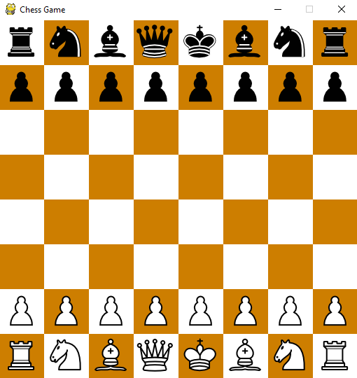

# Chess_Game
This is a Chess game made by python (Pygame). You can play it with your friends  :)

The game is not finished yet. I'm working to compelete it soon.
Things that isn't finished: Stale mate, Draw, Promotion, En passant.

### Note:-
If There is an error when you try to open the game change line 9 in Code/Chess_Main.py to be like this "import Chess_Engine".

### Picture of the game:

